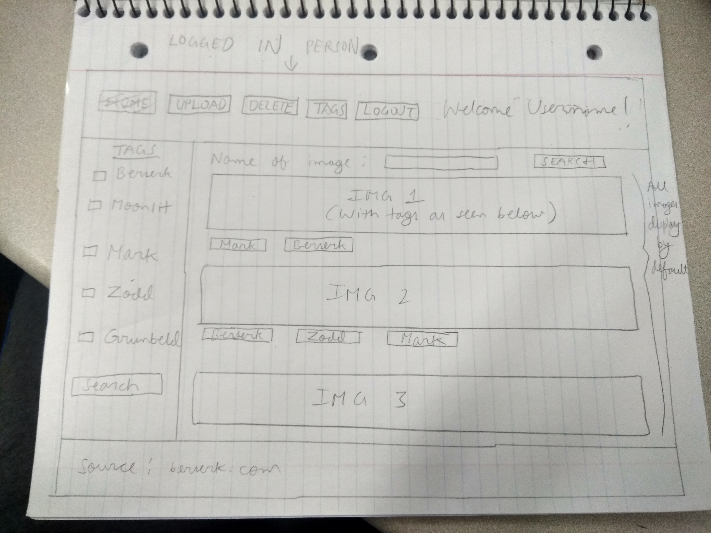

# Project 3 - Design & Plan

Your Name: Amartya Utkarsh

## 1. Persona

I've selected Abby as my persona.


I've selected my persona because the general population for my target audience won't be technology fanatics, so I need to keep my site as simple and easily navigable as possible. I need to implement normal design design conventions so that my target audience don't get frustrated in using my website.
For example, I have added different pages with clear navigation buttons so that my user is sure where they are and what they are doing. I am also using appropriate errors for my forms so that my user is sure of what they entered wrong in the form and hence they won't get anxious or frustrated with the process of navigating the website itself.

## 2. Sketches & Wireframes

### Sketches


### Wirefames





I have added different pages with clear navigation buttons so that my user is sure where she is and what she is doing. The design is simple and efficient with each page being used for one type of thing so that my user doesn't get confused o lost. I have also restricted user input by making use of dropbox wherever I can so that my user is not confused about what she is doing(uploading/deleting).

### Updated Wirefames and Sketches

My wireframe and sketches are pretty much similar to the final rendition of my website. The only difference is that I have changed my tabs in the nav bar a bit and have hidden some pages from the nav bar, and showed other. Home is named Gallery now, and Tags page is hidden now(it's linked to Edit Image button in pic.php). I have also removed the delete image page, and just added a delete tab below the enlarged image I display when a user selects an image in my gallery(which is displayed below).


## 3. Database Schema Plan

Table: images
* id: INTEGER {PRIMARY KEY, UNIQUE, NOT NULL, AUTO INCREMENT}
* image_title: TEXT {NOT NULL}
* image_ext: TEXT {NOT NULL}
* uploader: TEXT {NOT NULL}

Table: tags
* id: INTEGER {PRIMARY KEY, UNIQUE, NOT NULL, AUTO INCREMENT}
* tag_title: TEXT {UNIQUE, NOT NULL}

Table: images_tags
* id: INTEGER {PRIMARY KEY, UNIQUE, NOT NULL, AUTO INCREMENT}
* tags_id: INTEGER
* images_id: INTEGER {NOT NULL}

Table: accounts
* id: INTEGER {PRIMARY KEY, UNIQUE, NOT NULL, AUTO INCREMENT}
* username: TEXT {NOT NULL, UNIQUE}
* password: TEXT {NOT NULL}
* session: TEXT {UNIQUE}

## 4. Database Query Plan

1) All images

SELECT image_title, image_ext FROM images;

2) All tags

SELECT tag_title FROM tags;

3) Search for all tags for one image

SELECT tags.tag_title FROM images_tags INNER JOIN tags ON images_tags.tags_id = tags.id WHERE images_tags.images_id=:id;

4) Search for all images for one tag

SELECT images.image_title FROM images_tags INNER JOIN images ON images_tags.tags_id = images.id WHERE images_tags.tags_id=3;

5) Uploading a new image

Uploader will store $current_user so that I can later verify if the image that the user wants to delete was uploaded by him or not.

INSERT INTO images(image_title, image_ext, uploader) VALUES (:title, :ext, :uploader);

6) Deleting an image

First check if $current_user is uploader or not.

DELETE FROM images_tags WHERE images_id= :id;
DELETE FROM images WHERE id= :id;

7) Uploading a new tag

INSERT INTO tags(tag_title) VALUES (:title);

8) Uploading a tag to an image

INSERT INTO images_tags(images_id, tags_id) VALUES (:id1, :id2);

9) Check if password is right or not for login

SELECT * FROM accounts WHERE username = :username;
If records returned that means correct username. Then check if the password entered corresponds to the one stored in table.

## 5. Structure and Pseudocode

### Structure

* index.php - main page(for log in).
* gallery.php- page for all users to view all images and tags.
* pic.php- age for all users to view single images and tags.
* upload.php- page for logged in users where they can upload images.
* tags.php- page for all users where they can add/delete tags to images(Won't show in nav bar).
* logout.php- page when user logs out.
* includes/init.php - stuff that useful for every web page.
* includes/header.php- stuff that useful for every web page like nav bar generated by a loop.
* includes/footer.php- has stuff that's common to all webpage like source.

### Pseudocode

#### index.php

```
Pseudocode for index.php...

include init.php

make nav bar with just login and gallery tab

make login form
```

#### gallery.php

```
Pseudocode for gallery.php...

var current_page_id = filename

get all images from images table by default
get images as per specified in search fields using sql query

include init.php

include header.php

display images

display tags which user can click to search

include footer.php
```

#### upload.php

```
Pseudocode for upload.php...

var current_page_id = filename

filter form input and add image to uploads images folder and add row to images table

include init.php

include header.php

make upload form
```

#### pic.php

```
Pseudocode for pic.php...

get all tags for selected image from database

include init.php

include header.php

Display individual image

Show edit tag

Check if person who is deleting the image is the uploader. If so, then only let him delete the image and show delete tag.

Display all tags for displayed image.

include footer.php
```

#### tags.php

```
Pseudocode for tags.php...

var current_page_id = filename

filter form input and add row to tags table for add form.

Delete rows from tags table for delete form.

include init.php

include header.php

make tags add and remove forms

```

#### logout.php

```
Pseudocode for logout.php...

include init.php

log out the logged in user

show message that logged out and link to login page.

```

#### includes/init.php

```
array pages=( "index"=> "Index",....)

messages = array to store messages for user (you may remove this)

Record a message to display to the user.

// DB helper functions (you do not need to write this out since they are provided.)

db = connect to db

Check if we should login the user
if logged in, create a session cookie and store session in database

check if logged in or not

function is_uploader($imgid)
// check if uploader of image is equal to $current_user

```

#### includes/header.php

```
  if ($current_user) is set, select array with all tabs else select array with just login and gallery tab
  Also display Logged in as username in nav bar if $current_user is set, else display Image Gallery

(nav)

  (ul)

for each ( key => value in pages )

    begin

    if current_page_id=key then

        begin

        print "(li) (a class = 'active' link= 'key.php')value(/a)(/li)"

        end

    Otherwise

        begin  

        print "(li)(a href='key.php')value(/a)(/li)"

        end


    end
  (/ul)

(/nav)
```

#### includes/footer.php

```
Source= "";

```

## 6. Seed Data - Username & Passwords

* user01 : password1
* user02 : password2

## 7. Additional comments

All tags in my database all in lowercase, so I convert all tag names to lowercase before I store
them. This is the design my gallery follows.

On deleting a tag from an image, I don't delete it from the tags table, because for my design, I want all tags to be present, so that other users can use them later on, even if they are not used right now. Something out of scope right now is that I would have added a moderator who could delete tags from tags table too.

For uploading images, I am only accepting files that have common image extensions, and I am also limiting file size to 10MB. I am also taking precaution for if someone messes with the URL to put in wrong GET values. I am also checking for duplicate tags before adding them, and checking if tags/ images exist before deleting them.
